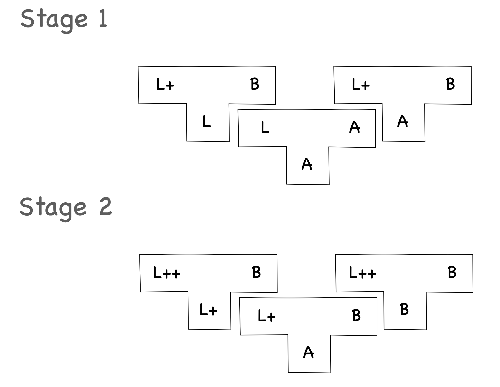

<h1 align=center>编译原理 第一次理论作业</h1>

<h1 align=center>18340052  何泽</h1>

## Exercise 1.1

> 1. Imagine an artificial computer language, which can be utilized to solve a practical problem, i.e. the application of the language.
>     - Tips 1. Language is an alternative approach to problem solving.
>     - Tips 2. First find a proper problem, then design a language to solve the problem.
> 2. Give an example of a complete piece written in the proposed language.
> 3. Discuss how to define the new language and try your approach.
> 4. Describe the process of changing the thinking of your language to a reality, i.e. how to make the artificial language usable

1. 我设计的语言想要解决的问题是实现计算器的某些功能，包括加、减、乘、除、幂、对数和开根号。

    这种语言所解决的计算均为二元计算，每条语句以运算符开始，后面为两个待计算的数字，以分号结束，并且运算符与两个操作数以“&”分开，中间可以有随意数量的空格。

    运算符（假设第一个数字为a，第二个为b）：

    - `+-*/`分别代表加减乘除；
    - `^`代表幂运算，后面第一个为底数，第二个数字为指数，即 $a^b$；
    - `$`代表对数运算，第一个数为底数，第二个数为真数，即 $log_ab$；
    - `@`表示开根号，第一个数字为根指数，第二个数为准备开根号的数字，即 $\sqrt[a]{b}$。

2. 一个例子：

    ```txt
    + & 3 & 5;  //3+5
    * & 2 & 3;  //2*3
    / & 10 & 5; //10/5
    ^ & 2 & 3;  //2的3次方
    $ & 2 & 8;  //以2为低8的对数
    @ & 2 & 4;  //开根号，4的2次方跟，即根号2
    ```

3. 对语言的定义：

    - 字符集

        `{1,2,3,4,5,6,7,8,9,0,+,-,*,/,^,$,@,;}`

    - BNF：

        ```txt
        <计算语句> ::= <运算符> & integer & integer ;
        ```

        ```txt
        <运算符> ::= + | - | * | / | ^ | $ | @
        ```

        ```txt
        integer ::= [ symbol ] unsigned
        unsigned ::= digit { digit }
        symbol ::= + | -
        digit ::= 0 | 1 | ... | 9
        ```

4. 如果想要实现这门语言，当读到指令之后按照`&`进行分词，先读第一个操作符，针对每种计算分别编写不同的程序，然后读后面的两个操作数，再传给程序计算即可。

## Exercise 1.2

> Draw a T-diagram with two stages of bootstrappings.
>
> - Given a new programming language L++, we firstly implement L, a small subset of L++.
> - Then we use L to implement L+, a subset of L++ and a superset of L.
> - Finally, L++ is implemented using L+.

