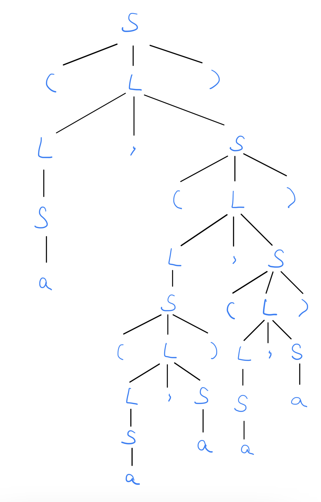
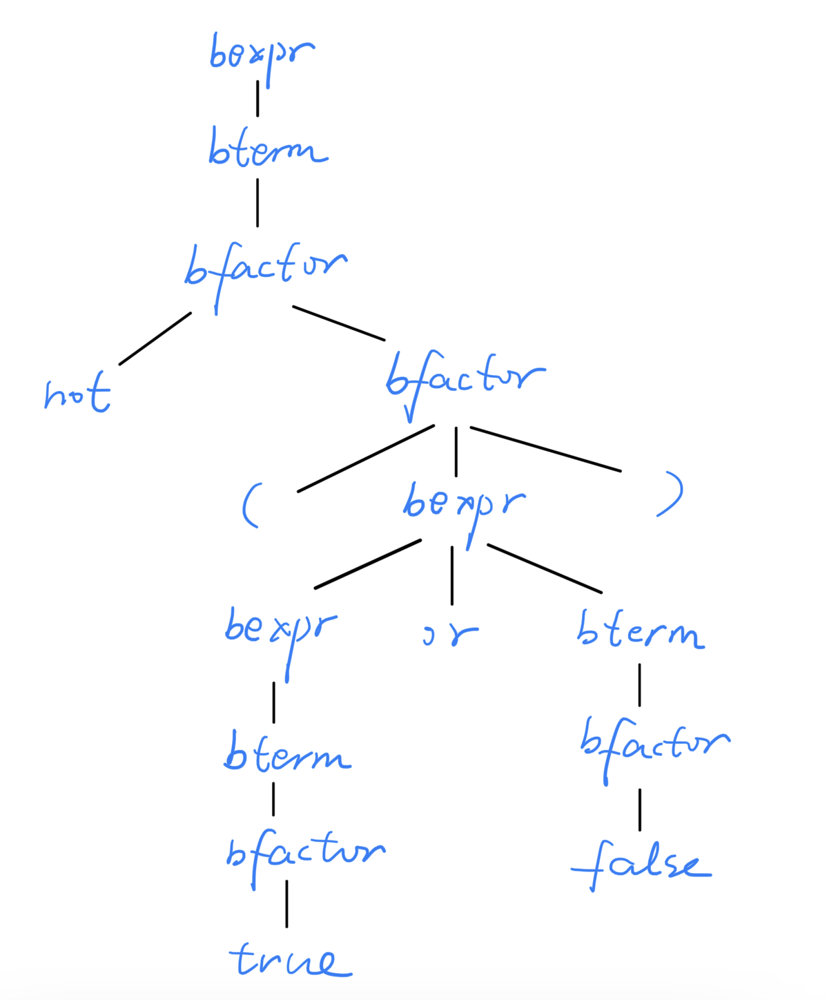
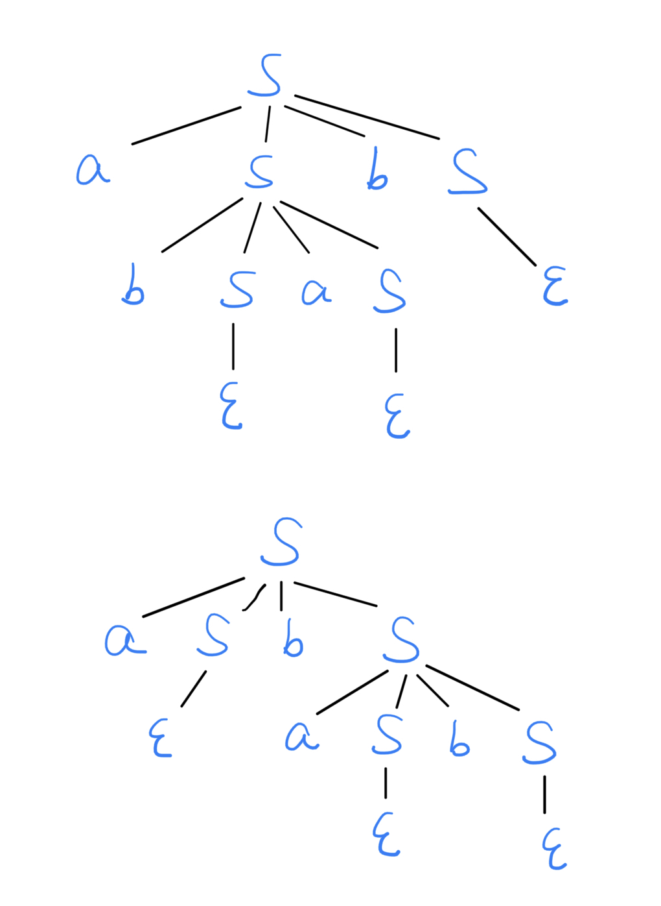

<h1 align=center>编译原理 第二次理论作业</h1>

<h1 align=center>18340052  何泽</h1>

## Exercise 2.1

> Given the following grammar:
>
> ​		S → **(** L **)** | **a**
>
> ​		L → L **,** S | S
>
> Construct a parse tree for the sentence
>
> ​		**( a , ( ( a ,  a ) , ( a , a ) ) )**

## Exercise 2.2

> Given the following grammar:
>
> ​	bexpr → bexpr **or** bterm | bterm
> ​		   bterm → bterm **and** bfactor | bfactor
>  		  bfactor → **not** bfactor | **(** bexpr **)** | **true** | **false**
>
> Construct a parse tree for the sentence
>
> ​	**not (true or false)**

## Exercise 2.3

> Is the grammar:
>
> ​		 S → aS b S | b S aS | $\epsilon$
>
> ambiguous? Why?

如下图，

对于abab有两种语法树，所以是具有二义性的。