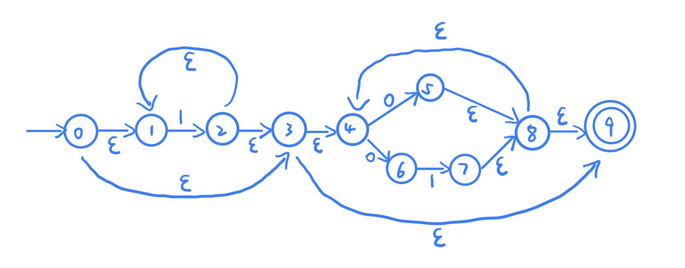
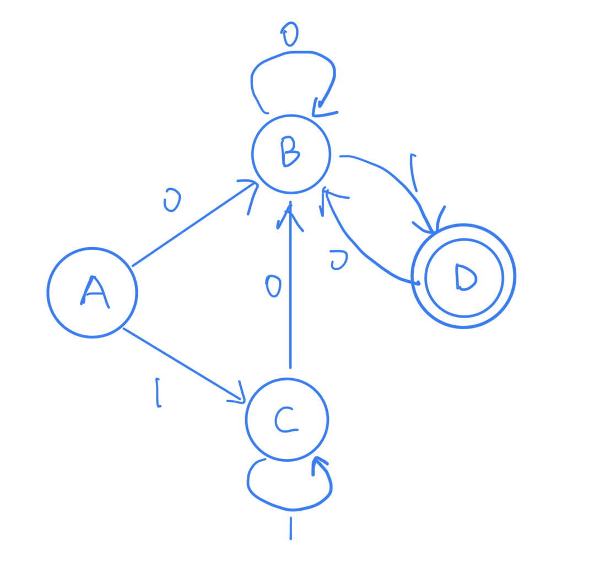
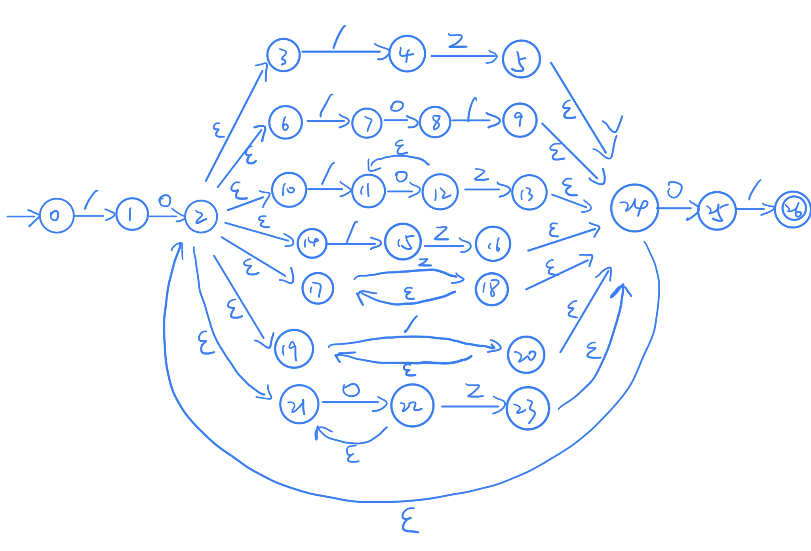

<h1 align=center>编译原理 第三次理论作业</h1>

<h1 align=center>何泽  18340052</h1>

## Exercise 3.1

> Give the recognized tokens of the following program in Pascal.
>
> ```pascal
> function max(i, j: integer): integer; 
> {return the maximum of integers i and j} 
> begin
> 	if i > j then max := i else max := j 
> end;
> ```

<Reserved words, function>, <Identifiers, max>, <Punctuation, ( >, <Identifiers, i>, <Punctuation, , >, <Identifiers, j>, <Punctuation, : >, <Reserved words, integer>,  <Punctuation, ) >,  <Punctuation, : >, <Reserved words, integer>,  <Punctuation, ;>, <Punctuation, { >, <Constants, "return the maximum of integers i and j">, <Punctuation, } >, <Reserved words, begin>, <Reserved words, if>, <Identifiers, i>, <Operators, > >, <Identifiers, j>, <Reserved words, then>, <Identifiers, max>,  <Operators, := >, <Identifiers, i>, <Reserved words, else>, <Identifiers, max>,  <Operators, := >, <Identifiers, j>, <Reserved words, end>, <Punctuation, ;>

## Exercise 3.2

> (DBv2, Ch.3, pp.125, ex.3.3.2)Describe the languages denoted by the following regular expressions:
>
> - a (a | b)* a
> - a* b a* b a* b a*

- a (a | b)* a

    以a开头和结尾的由a和b组成的字符串

- a* b a* b a* b a*

    只包含三个b的由a和b组成的字符串

## Exercise 3.3

> (DBv2, Ch.3, pp.125, ex.3.3.4) Most Languages are case sensitive, so keywords can be written only one way, and the regular expressions describing their lexemes are very simple.
>
> However, some languages, like Pascal and SQL, are case insensitive. For example, the SQL keyword **SELECT** can also be written **select**, **Select**, or **sELEcT**.
>
> Show how to write a regular expression for a keyword in a case insensitive language. Illustrate your idea by writing the expression for **SELECT** in SQL.

select —> (s|S)(e|E)(l|L)(e|E)(c|C)(t|T) 

## Exercise 3.4

> Given the following regular expression
>
> ​						1\*(0 | 01)\*
>
> 1. Transform it to an equivalent finite automaton.
> 2.  Construct an equivalent DFA for the result of exercise (1).
> 3. Reduce the result of (2) and get a reduced DFA.

1. 



2. 

|      NFA      | DFA  |      0      |       1       |
| :-----------: | :--: | :---------: | :-----------: |
| {0,1,3,4,8,9} |  A   | {4,5,6,8,9} |  {1,2,3,4,9}  |
|  {4,5,6,8,9}  |  B   | {4,5,6,8,9} |   {4,7,8,9}   |
|  {1,2,3,4,9}  |  C   | {4,5,6,8,9} |  {1,2,3,4,9}  |
|   {4,7,8,9}   |  D   | {4,5,6,8,9} | $\varnothing$ |



3. 

上图已经是最小DFA了：


## Exercise 3.5

> Given the alphabet $\Sigma$ = { z, o, / }, a comment in a program over $\Sigma$ begins with "/o" and ends with "o/". Embedded comments are not permitted.
>
> 1. Draw a DFA that recognizes nothing but all the comments in the source programs.
> 2. Write a single regular expression that exactly describes all the comments in the source programs.

1. 



2. 

begin —> /o

end —> o/

middle —>  /z | /o/ | /oo^*^z | /z | zz^*^ | //^*^ | oo^*^z

comments —> (begin)(middle)^*^(end)