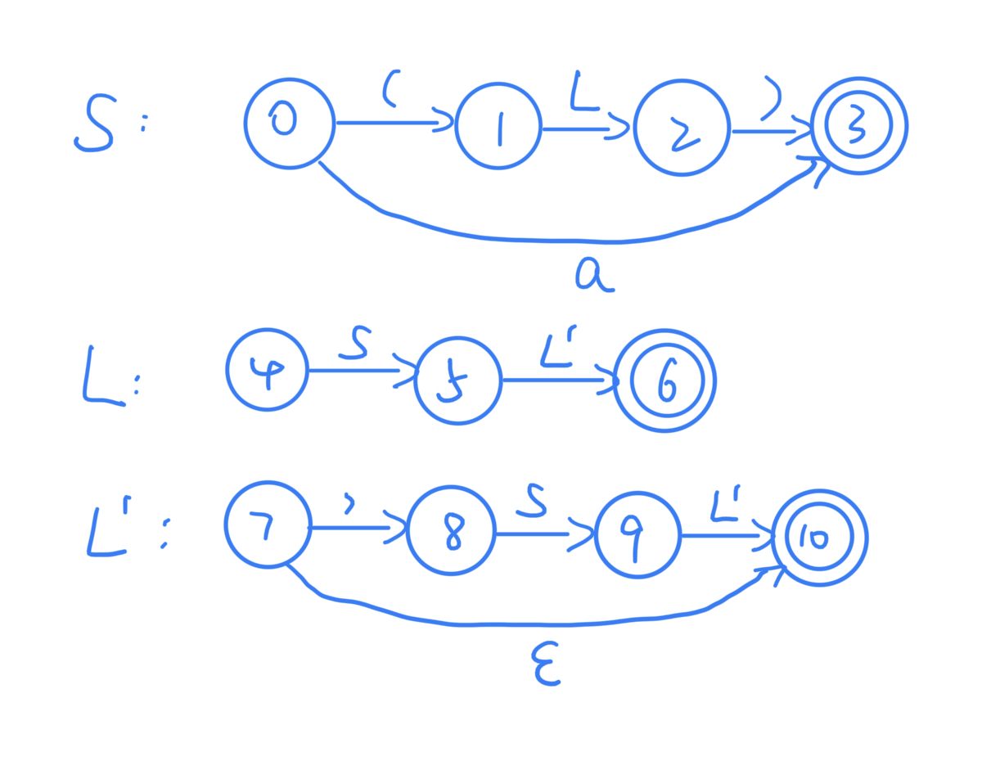

<h1 align=center>编译原理 第四次理论作业</h1>

<h1 align=center>18340052  何泽</h1>

## Exercise 4.1

> Given the following grammar 
>
> ​		S → **(** L **) **| **a**​
>
> ​		L → L , S | S
>
> - Eliminate left recursions in the grammar.
> - Draw the transition diagrams for the grammar.
> - Write a recursive descent predictive parser.
> - Indicate the procedure call sequence for an input sentence **(a, (a, a))**.

1. 消除左递归如下：
    $$
    \begin{aligned}
    S &\to (L)\mid a \\
    L &\to SL' \\
    L' &\to , SL'\mid\epsilon
    \end{aligned}
    $$

2. 

    

3. 

    ```c
    void match(Token tok) {
        if (lookahead == tok) {
        	lookahead = scanner.getNextToken(); 
        } else error();
    }
    ```

    ```c
    void S() throws SyntacticException {
        if (lookahead.equals(new Token('('))) {
            match(new Token('(')); 
            L();
            match(new Token(')'));
        } else if (lookahead.equals(new Token(a))) { 
            match(new Token(a));
        } else {
        	throw new SyntacticException();
        }
    }
    ```

    ```c
    void L() throws SyntacticException {
        S();
        L`();
    }
    ```

    ```c
    void L` () throws SyntacticException {
        if (lookahead.equals(new Token(','))){
            match(new Token(','));
            S();
            L`();
        } else if (lookahead in FOLLOW(L`)){
        }else {
        	throw new SyntacticException();
        }
    }
    ```

4. 

    |   Matched   |    Stack     |     Input     |         Action         |
    | :---------: | :----------: | :-----------: | :--------------------: |
    |             |    $S\$$     | $(a,(a,a))\$$ |                        |
    |             |   $(L)\$$    | $(a,(a,a))\$$ |   output $S\to (L)$    |
    |     $($     |    $L)\$$    | $a,(a,a))\$$  |                        |
    |     $($     |   $SL')\$$   | $a,(a,a))\$$  |   output $L\to SL'$    |
    |     $($     |   $aL')\$$   | $a,(a,a))\$$  |    output $S\to a$     |
    |    $(a$     |   $L')\$$    |  $,(a,a))\$$  |                        |
    |    $(a$     |  $,SL')\$$   |  $,(a,a))\$$  |  output $L'\to ,SL'$   |
    |    $(a,$    |   $SL')\$$   |  $(a,a))\$$   |                        |
    |    $(a,$    |  $(L)L')\$$  |  $(a,a))\$$   |   output $S\to (L)$    |
    |   $(a,($    |  $L)L')\$$   |   $a,a))\$$   |                        |
    |   $(a,($    | $SL')L')\$$  |   $a,a))\$$   |   output $L\to SL'$    |
    |   $(a,($    | $aL')L')\$$  |   $a,a))\$$   |    output $S\to a$     |
    |   $(a,(a$   |  $L')L')\$$  |   $,a))\$$    |                        |
    |   $(a,(a$   | $,SL')L')\$$ |   $,a))\$$    |   output $L'\to,SL'$   |
    |  $(a,(a,$   | $SL')L')\$$  |    $a))\$$    |                        |
    |  $(a,(a,$   | $aL')L')\$$  |    $a))\$$    |    output $S\to a$     |
    |  $(a,(a,a$  |  $L')L')\$$  |    $))\$$     |                        |
    |  $(a,(a,a$  |   $)L')\$$   |    $))\$$     | output $L'\to\epsilon$ |
    | $(a,(a,a)$  |   $L')\$$    |     $)\$$     |                        |
    | $(a,(a,a)$  |    $)\$$     |     $)\$$     | output $L'\to\epsilon$ |
    | $(a,(a,a))$ |     $\$$     |     $\$$      |                        |

## Exercise 4.2

> Consider the context-free grammar  S →  **a** S **b** S | **b** S **a** S | $\epsilon$
>
> - Can you construct a predictive parser for the grammar? and why?

不能，因为这个语法有二义性且含有左递归。

## Exercise 4.3

> Compute the FIRST and FOLLOW for the start symbol of the following grammar
>
> ​		S → S S **+** | S S ***** | **a**

FIRST(S) = {a}

FOLLOW(S) = {a,+,*}