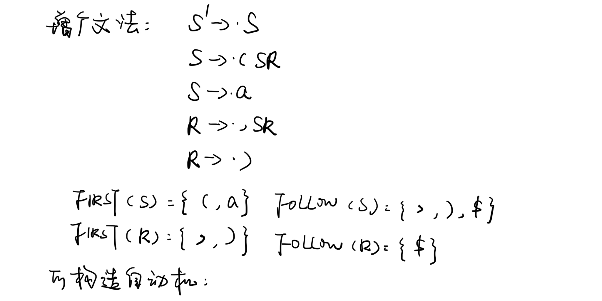
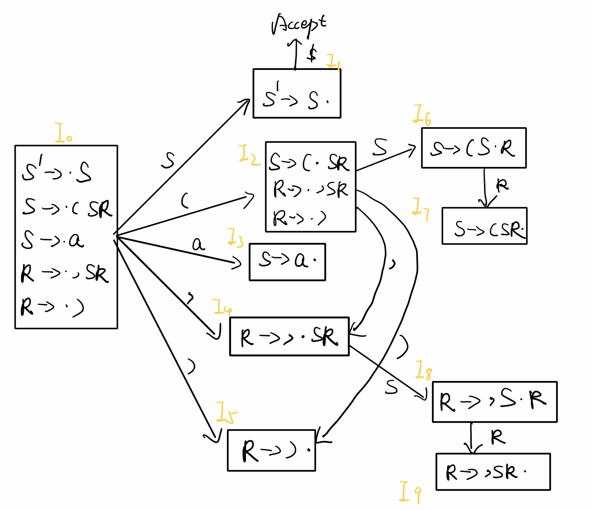
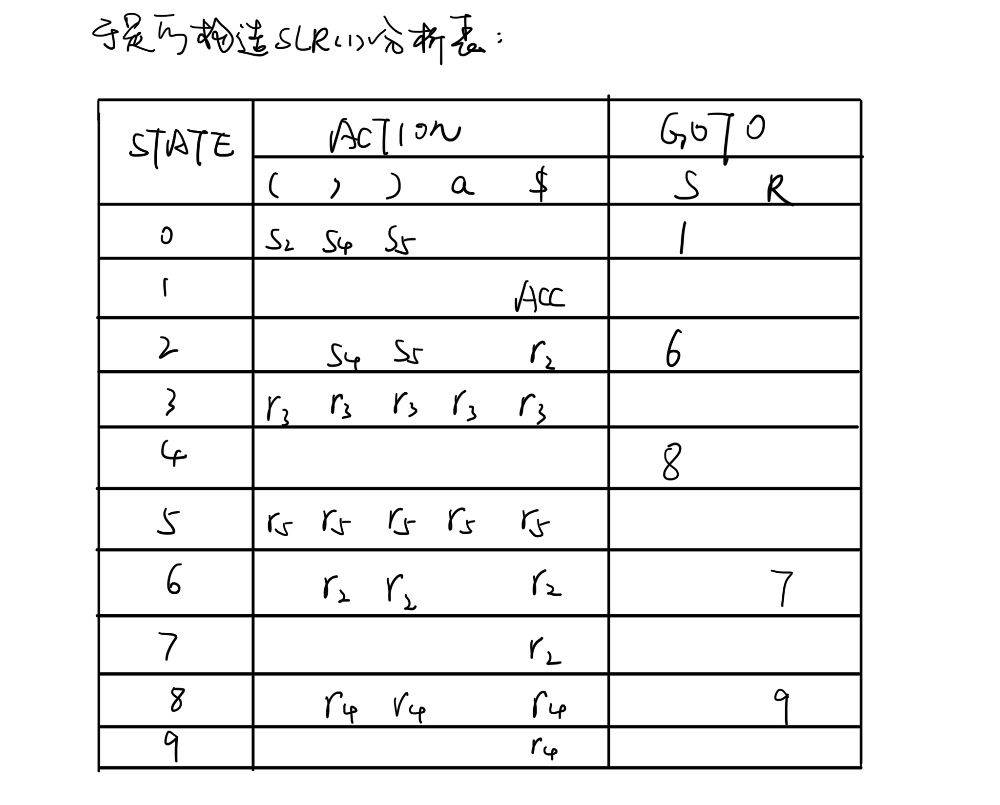
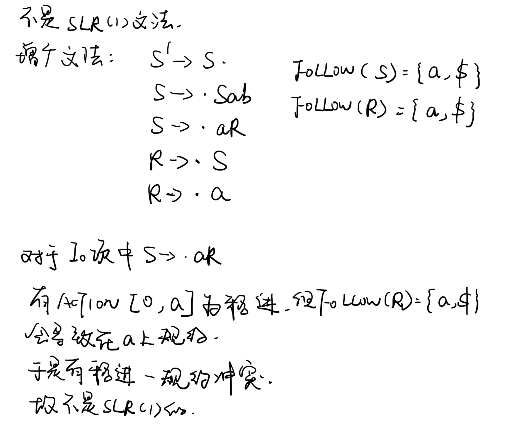
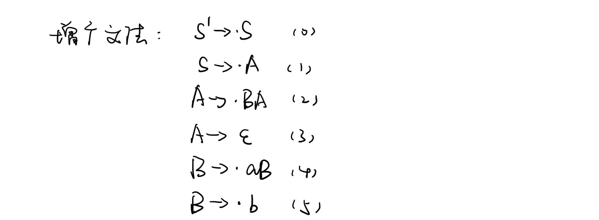
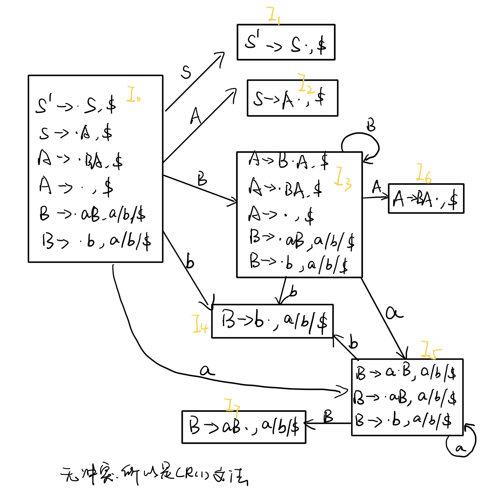
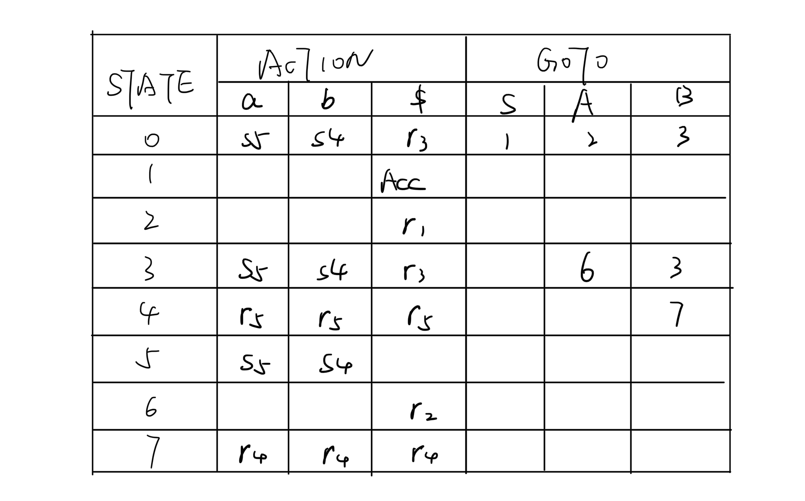
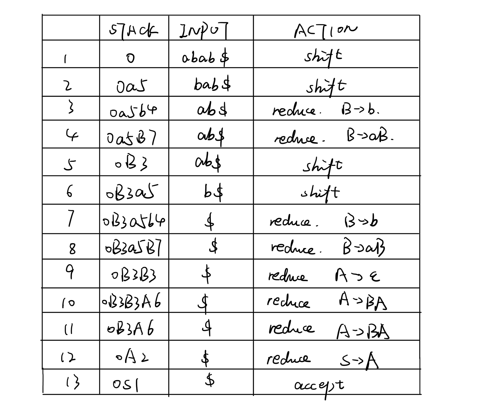
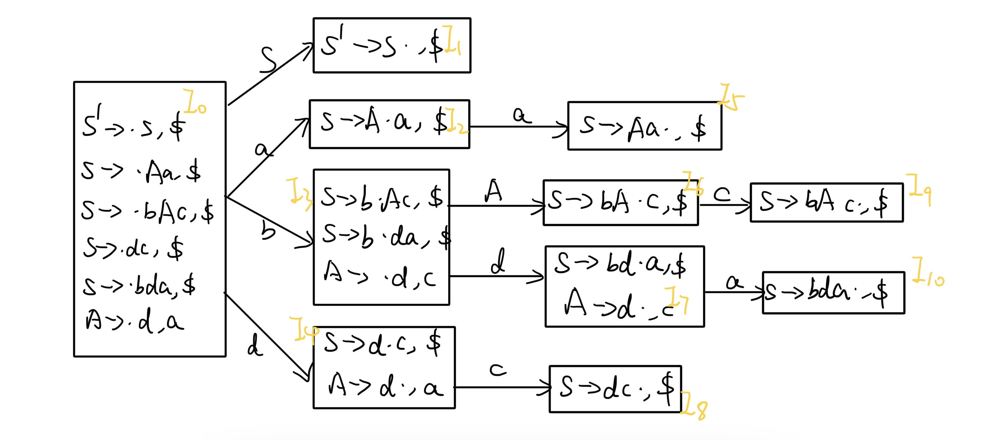
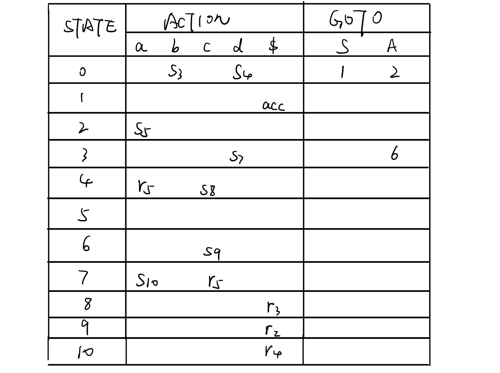

<h1 align=center>编译原理第七次理论作业</h1>

<h1 align=center>18340052  何泽</h1>

## Exercise 7.1

> Consider the grammar 
>
> ​		S → **(** SR | **a**
>
> ​		R → **,** SR | **)**
>
> Try to construct an SLR(1) parsing table for the grammar, and see if there are conflicts in the parsing table.

没有冲突

## Exercise 7.2

> Consider the grammar 
>
> ​		S → S**a b** | **a** R
>
> ​		R→S|**a**
>
> Is the grammar an SLR(1) grammar? and why?

## Exercise 7.3

> Consider the grammar
>
> ​		 S→A
>
> ​		A→BA|$\epsilon$
>
> ​		B→**a**B|**b**
>
> - Prove that the grammar is an LR(1) grammar.
> - Construct an LR(1) parsing table for the grammar.
> - Show the detailed parsing procedure for the sentence **abab**, following the style in slides of this lecture.

(1)

(2)

(3)

## Exercise 7.4

> Show that the grammar
>
> ​		S → A**a** | **b**A**c** | **d c** | **b d a**
>
> ​		A→**d** 
>
> is LALR(1) but not SLR(1).

并无冲突，可以看出是LALR(1)的，但是I~7~ 下一个符号是a，但是FOLLOW(A)={a,c}，于是产生移入规约冲突，所以不是SLR(1)。

