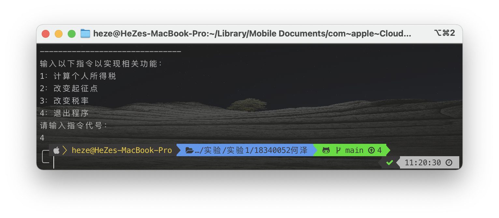
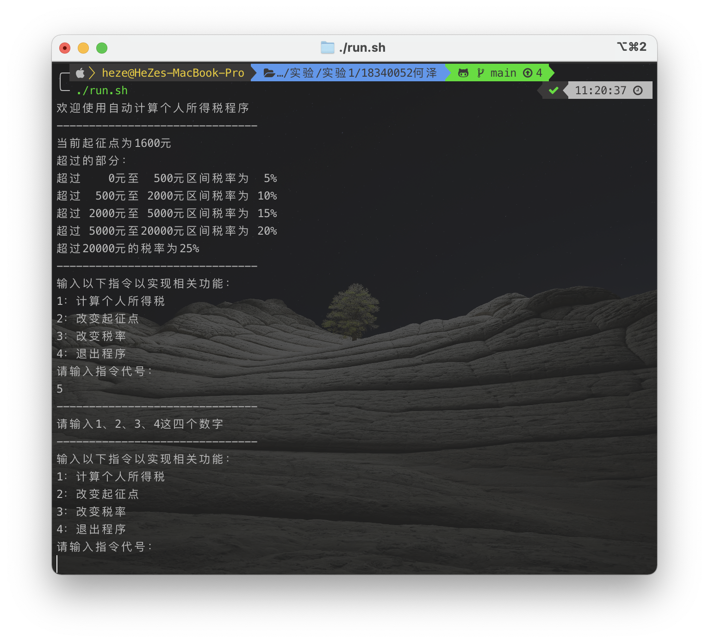

<h1 align=center>编译原理 第一次实验设计方案</h1>

<h1 align=center>18340052  何泽</h1>

## 一、设计思路

### 1. UML类图


### 2. 结构描述

我设计了三个类，其中：

- 类`Presentation`用于显示界面以及和用户交互IO
- 类`TaxTable`根据计税规则维护一个表，包括创建和修改，并包括规则某些金额的获取函数供其他类调用
- 类`TaxCalculator`用于计算所得税的具体金额

> **上面只为简述，各个类的详细信息、各变量含义、各函数含义与参数意义详见代码注释或`JavaDoc`文档**

## 二、编译与运行

### 1. JDK版本：Java8


### 2. 编译与运行

在主目录下（即src文件夹的父目录）运行：

```sh
javac -sourcepath src -d out src/*.java
cd out
java personaltax.Presentation
```

此外，我已将这三条命令写到了批处理文件`run.sh`中，也可以直接运行：

```bash
./run.sh
```

## 三、运行截图

1. 运行后的开始界面，会显示当前各种信息：

    

2. 指令“1”，计算所得税金额

    

    这个测例即为要求文档中的例子，工资4300元所得税280元。

3. 指令“2”，改变起征点金额

    

4. 指令“3”，改变税率及计税规则

    
   
5. 指令“4”，退出程序

    

## 四、错误数据处理

除了基础功能外，如果输入了一些“不合法”的数据，程序也会提示并要求重新输入：

- 输入的指令并非1、2、3或4:

    
  
- 输入的起征点金额不大于0:

    

- 输入的税率不在0-1之间：

    