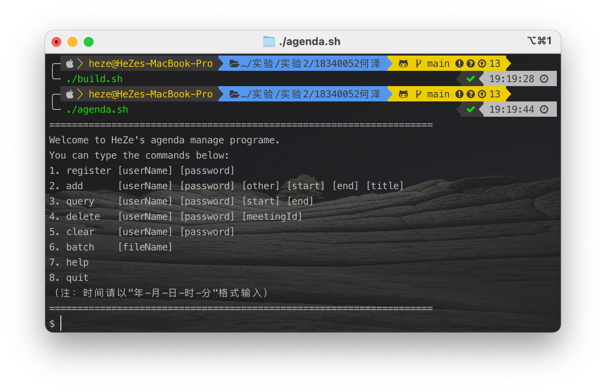
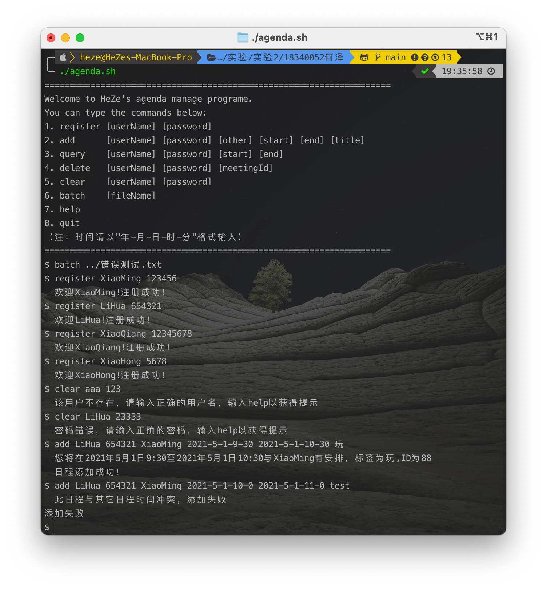

<h1 align=center>测试用例与截图<h1/>
<h1 align=center>18340052  何泽<h1/>

[TOC]

## 一、编译与运行

> 在某些操作系统中可能无法直接执行脚本文件，需要先输入以下命令：
>
> ```sh
> chmod +x build.sh
> chmod +x agenda.sh
> ```
> 

- 编译

    在主目录下通过终端运行：
    
    ```sh
    javac -sourcepath src -d bin src/*.java
    ```
    
    或直接运行脚本文件：
    
    ```shell
    ./build.sh
    ```

- 运行

    进入到`bin`目录中再运行，即执行以下命令：

    ```sh
    cd bin
    java AgendaService
    ```

    或直接运行脚本文件：

    ```sh
    ./agenda.sh
    ```

## 二、运行单条指令截图

- 运行后进入开始界面：

    

- 注册

    

- 添加日程

    

- 查询日程

    

    **（更多的例子详见下面的文件测例）**

## 三、文件多命令测例

只需要输入`batch 文件目录/文件名`即可，我在主目录中提供了两个测例，分别是`test1.txt`以及`错误测试.txt`，其中前者是正常的测试程序功能的测例，后者为输入一些错误的信息可以看到程序的异常处理即测试程序的健壮性。想要运行需要在程序中输入：

```sh
batch ../test1.txt
batch ../错误测试.txt
```

可以看到如下结果：


可以看到上面的测例中不包含删除某一日程，这是因为实验要求根据ID删除日程，但是日程ID是随机的，故无法提前写入测例，只能手动输入（接着上面输入）：


**可以看到实现的所有的功能都是正确的**

## 四、异常处理（即程序健壮性测试）

（下面的输入都是接着上面test1.txt之后输入的）

- 用户名错误

    

- 密码错误

    

- 想要添加的日程与已有日程冲突

    

- 当然，为了测试健壮性我也写成了一个测例，即上面的`错误测试.txt`

    


**从以上结果可以看出程序功能完善，且具有一定的健壮性。**

