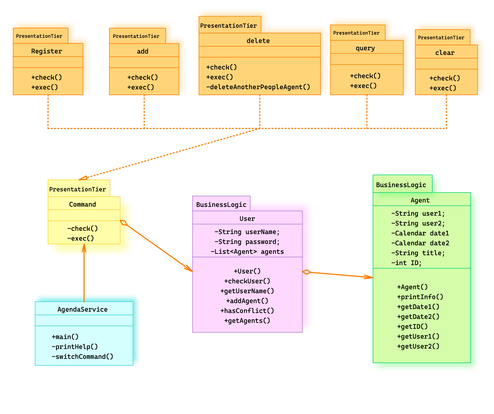

<h1 align=center>设计思路</h1>

<h1 align=center>18340052  何泽</h1>

## UML类图：

## 设计思路描述

- `AgendaService.java`为主文件，展示开始界面，并读取用户输入，得到输入后便实例化一个`Command`对象
- `Command.java`为一个虚拟类接口，根据传入的命令不同被实例化为不同的对象
- 主函数会创建一个`Users`列表，`Command`对象在执行过程中会实例化`User`对象并插入到列表中，其中的每个`User`都含有一个`Agent`列表，存储着这个用户所有的日程
- 各方法的具体实现详见代码注释或`JavaDoc`文档