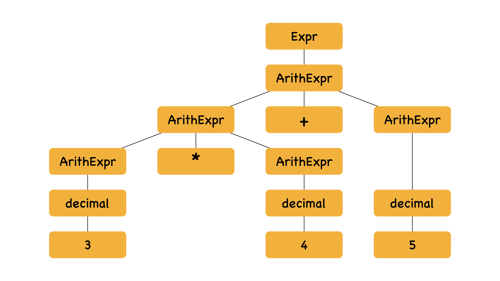
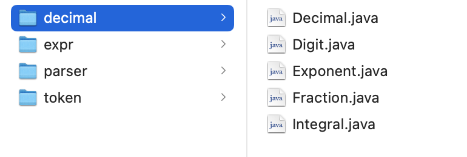

<h1 align=center>基于表达式的计算器ExprEval</h1>

<h1 align=center>18340052  何泽</h1>

[toc]

## 一、讨论语法定义的二义性

根据如下BNF：


该语法是具有二义性的，比如对于`3*4+5`就可构造出两种语法树：




由此可以得出改语法具有二义性。针对这种二义性可以通过定义运算符优先级来解决。

## 二、设计并实现词法分析程序

### 1. 单词分类

如下图token文件夹所示（Token类为虚拟类接口，其余为实例）：


我将单词进行如下分类：

- 布尔类型
- 数值类型（包含小数和科学技术法）
- $
- 运算符（预定义的函数也在其中）
- 标点符号（本实验即逗号）

除了\$不用识别外，将所有输入的单词分为了以上的四类，也即算术运算符和关系运算符看做一类token，另外根据输入的字符可以很轻松没有二义地分类。

### 2. 数值类型

在这几类中数值类型是相对较复杂的，文档中的BNF如下：


所以按照上面的BNF我单独写了一个软件包以实现相关内容，也即decimal文件夹：


识别为数值类型后可按照如下自动机转换：


以此便可解决小数、科学计数法的数值常量。

### 3. 其它类型

除了数值类型之外的其它类型的词法分析就简单很多了，识别到属于哪个类型只需要把相关的符号参数等传给ruduce程序即可。

## 三、构造算符优先关系表

构造与表格顺序按照如下优先级表：(级别7的关系运算符在表格中归为一类)


|              |     bool      |   num    |    (     |      )       |     func      |       -       |       ^       |      */       |      +-       |   Relation    |       !       |       &       |      \|       |       ?       |    :    |       ,       |    $    |
| :----------: | :-----------: | :------: | :------: | :----------: | :-----------: | :-----------: | :-----------: | :-----------: | :-----------: | :-----------: | :-----------: | :-----------: | :-----------: | :-----------: | :-----: | :-----------: | :-----: |
|   **bool**   |   Miss Ope    | Miss Ope | Miss Ope |    reduce    |   Miss Ope    | Type Mismatch | Type Mismatch | Type Mismatch | Type Mismatch | Type Mismatch |   Miss Ope    |    reduce     |    reduce     |    reduce     | reduce  | Type Mismatch | reduce  |
|   **num**    |   Miss Ope    | Miss Ope | Miss Ope |    reduce    |    reduce     |    reduce     |    reduce     |    reduce     |    reduce     |    reduce     | Type Mismatch |    reduce     |    reduce     |    reduce     | reduce  |    reduce     | reduce  |
|    **(**     |     shift     |  shift   |  shift   |    shift     |     shift     |     shift     |     shift     |     shift     |     shift     |     shift     |     shift     |     shift     |     shift     |     shift     |  shift  |     shift     | Miss )  |
|    **)**     |   Miss Ope    | Miss Ope | Miss Ope |    reduce    |   Miss Ope    |    reduce     |    reduce     |    reduce     |    reduce     |    reduce     |   Miss Ope    |    reduce     |    reduce     |    reduce     | reduce  |    reduce     | reduce  |
|   **func**   |    Miss (     |  Miss (  |  shift   |    reduce    |    Miss (     |    Miss (     |    Miss (     |    Miss (     |    Miss (     |    Miss (     |    Miss (     |    Miss (     |    Miss (     |    Miss (     | reduce  |    Miss (     | Miss (  |
|    **-**     | Type Mismatch |  shift   |  shift   |    reduce    |     shift     |     shift     |    reduce     |    reduce     |    reduce     |    reduce     | Type Mismatch | Type Mismatch | Type Mismatch | Type Mismatch | reduce  |    reduce     | reduce  |
|    **^**     | Type Mismatch |  shift   |  shift   |    reduce    |     shift     |     shift     |     shift     |    reduce     |    reduce     |    reduce     | Type Mismatch | Type Mismatch | Type Mismatch | Type Mismatch | reduce  |    reduce     | reduce  |
|    ***/**    | Type Mismatch |  shift   |  shift   |    reduce    |     shift     |     shift     |     shift     |    reduce     |    reduce     |    reduce     | Type Mismatch | Type Mismatch | Type Mismatch | Type Mismatch | reduce  |    reduce     | reduce  |
|    **+-**    | Type Mismatch |  shift   |  shift   |    reduce    |     shift     |     shift     |     shift     |     shift     |    reduce     |    reduce     | Type Mismatch | Type Mismatch | Type Mismatch | Type Mismatch | reduce  |    reduce     | reduce  |
| **Relation** | Type Mismatch |  shift   |  shift   |    reduce    |     shift     |     shift     |     shift     |     shift     |     shift     |    reduce     |    reduce     |    reduce     |    reduce     |    reduce     | reduce  | Type Mismatch | reduce  |
|    **!**     |     shift     |  shift   |  shift   |    reduce    | Type Mismatch | Type Mismatch | Type Mismatch | Type Mismatch | Type Mismatch |     shift     |     shift     |    reduce     |    reduce     |    reduce     | reduce  | Type Mismatch | reduce  |
|    **&**     |     shift     |  shift   |  shift   |    reduce    | Type Mismatch | Type Mismatch | Type Mismatch | Type Mismatch | Type Mismatch |     shift     |     shift     |    reduce     |    reduce     |    reduce     | reduce  | Type Mismatch | reduce  |
|    **\|**    |     shift     |  shift   |  shift   |    reduce    | Type Mismatch | Type Mismatch | Type Mismatch | Type Mismatch | Type Mismatch |     shift     |     shift     |     shift     |    reduce     |    reduce     | reduce  | Type Mismatch | reduce  |
|    **?**     |    TriOpeE    |  shift   |  shift   | Miss Operand |     shift     |     shift     |     shift     |     shift     |     shift     |     shift     |    TriOpeE    |    TriOpeE    |    TriOpeE    |     shift     |  shift  |    TriOpeE    | TriOpeE |
|    **:**     |    TriOpeE    |  shift   |  shift   |    reduce    |     shift     |     shift     |     shift     |     shift     |     shift     |     shift     |    TriOpeE    |    TriOpeE    |    TriOpeE    |    reduce     | reduce  |    reduce     | reduce  |
|    **,**     | Type Mismatch |  shift   |  shift   |    shift     |     shift     |     shift     |     shift     |     shift     |     shift     | Type Mismatch | Type Mismatch | Type Mismatch | Type Mismatch |     shift     |  shift  |     shift     | Miss )  |
|    **$**     |     shift     |  shift   |  shift   |    Miss (    |     shift     |     shift     |     shift     |     shift     |     shift     |     shift     |     shift     |     shift     |     shift     |     shift     | TriOpeE |    Miss (     |   Acc   |

**对于一元取负运算符和二元减法运算符，我在前面的scanner就进行判断，根据前一个token的类型，若前一个为数值类型或右括号则这个为二元减法运算符，其余情况为一元取负运算符。至于三元运算符与其他运算符、预定义函数与其他运算符只需要根据表格判断即可。**

## 四、设计并实现语法分析和语义处理程序

### 1. 主调用程序

下面为parser的主程序，根据输入的表达式的token类型查表进行shift、reduce、报错等操作

```java
public double parse() throws ExpressionException {
    lookahead = new Terminal(scanner.getNextToken());
    while (true) {
        Terminal topMostTerminal = getTopMostTerminal();
        switch (OPPTable.table[topMostTerminal.getTag()][lookahead.getTag()]) {
            case 0:
                shift();
                break;
            case 1:
                reduce();
                break;
            case 2:
                return accept();
            case -1:
                throw new MissingOperatorException();
            case -2:
                throw new MissingRightParenthesisException();
            case -3:
                throw new MissingLeftParenthesisException();
            case -4:
                throw new FunctionCallException();
            case -5:
                throw new TypeMismatchedException();
            case -6:
                throw new MissingOperandException();
            case -7:
                throw new TrinaryOperationException();
        }
    }
}
```

### 2. accept

如果是accept则返回最终结果：

```java
private double accept() throws TypeMismatchedException {
    Expr k = stack.get(stack.size() - 1);
    if (k.getTag() == Scanner.kingOfChar.BoolExpr) {
        System.out.println(((BoolExpr) k).getValue());
        throw new TypeMismatchedException();
    }
    return ((ArithExpr) k).getValue();
}
```

### 3. shift

shift操作也较为简单，将现在的入栈并读取下一个token

```java
private void shift() throws ExpressionException {
    stack.add(lookahead);
    lookahead = new Terminal(scanner.getNextToken());
}
```

### 4. reduce

reduce操作较为复杂，parse类中reduce程序只负责根据情况调用不同类型的reduce，实现部分单独放在了`reduce.java`中

- parse类中的调用如下（只是根据不同类型调用不同种类的reduce）：

    ```java
    private void reduce() throws ExpressionException {
        Terminal topMostTerminal = getTopMostTerminal();
        switch (topMostTerminal.getTag()) {
            case Scanner.kindOfChar.NUM:
                reducer.numReducer(stack);
                break;
            case Scanner.kindOfChar.BOOL:
                reducer.boolReducer(stack);
                break;
            case Scanner.kindOfChar.ADDSUB:
                reducer.add_subReducer(stack);
                break;
            /*
            中间部分为了节省篇幅省略，形式与前面一样，只是类型不同调用的函数不同
            */
            default:
                System.out.println(topMostTerminal.getTag());
                break;
        }
    }                                                                    
    ```

- 数字的reduce较简单，只是转换格式后加入到栈中

    ```java
    public void numReducer(ArrayList<Expr> stack) {
        int i = stack.size() - 1;
        Terminal k = (Terminal) stack.get(i);
        ArithExpr arithExpr = new ArithExpr((Decimal) k.token);
        stack.remove(i);
        stack.add(arithExpr);
    }
    ```

- 对于取负则将下一个token的值取相反数入栈，取非也一样，下面是取负的代码

    ```java
    public void negReducer(ArrayList<Expr> stack) throws ExpressionException {
        int i = stack.size() - 1;
        Expr k = stack.get(i);
        if (k.getTag() != Scanner.kindOfChar.ArithExpr)
            throw new TypeMismatchedException();
        double v = ((Decimal) k.token).getValue();
        ArithExpr arithExpr = new ArithExpr(-v);
        stack.remove(i);
        stack.remove(i - 1);
        stack.add(arithExpr);
    }
    ```

- 对于加减、乘除、与或操作则取前一个和后一个token进行相应计算，代码形式相同，下面以乘除为例例举代码：

    取栈中三个token，判断合法后获得结果后删除原token并将结果压栈
    
    ```java
    public void mul_divReducer(ArrayList<Expr> stack) throws ExpressionException {
        int i = stack.size() - 1;
        Expr a = stack.get(i - 2);
        Expr o = stack.get(i - 1);
        Expr b = stack.get(i);
        if ((b.getTag() == Scanner.kindOfChar.MULDIV))
            throw new MissingOperandException();
        if (a.getTag() != Scanner.kindOfChar.ArithExpr || b.getTag() != Scanner.kindOfChar.ArithExpr)
            throw new TypeMismatchedException();
        ArithExpr ae;
        if (o.token.getString().equals("*"))
            ae = new ArithExpr(((ArithExpr) a).getValue() * ((ArithExpr) b).getValue());
        else if (((ArithExpr) b).getValue() == 0)
            throw new DividedByZeroException();
        else
            ae = new ArithExpr(((ArithExpr) a).getValue() / ((ArithExpr) b).getValue());
        stack.remove(i);
        stack.remove(i - 1);
        stack.remove(i - 2);
        stack.add(ae);
    }
    ```
    
    **取幂操作也类似，就不再举例**
    
- 对于三元运算符则先判断布尔表达式，合法后根据布尔值删除其余的栈元素

    ```java
    public void colonReducer(ArrayList<Expr> stack) throws ExpressionException {
        int i = stack.size() - 1;
        Expr a = stack.get(i);
        Expr b = stack.get(i - 2);
        Expr c = stack.get(i - 3);
        Expr d = stack.get(i - 4);
        if (a.getTag() != Scanner.kindOfChar.ArithExpr || b.getTag() != Scanner.kindOfChar.ArithExpr || d.getTag() != Scanner.kindOfChar.BoolExpr)
            throw new TypeMismatchedException();
        if (c.getTag() != Scanner.kindOfChar.QM)
            throw new exceptions.TrinaryOperationException();
        if (((BoolExpr) d).getValue()) {
            stack.remove(i);
            stack.remove(i - 1);
            stack.remove(i - 3);
            stack.remove(i - 4);
        } else {
            stack.remove(i - 1);
            stack.remove(i - 2);
            stack.remove(i - 3);
            stack.remove(i - 4);
        }
    }
    ```

- 对于关系运算，则判断合法后根据关系运算调用其他函数判断最后将结果压栈

    ```java
    public void relationReducer(ArrayList<Expr> stack) throws ExpressionException {
        int i = stack.size() - 1;
        Expr a = stack.get(i - 2);
        Expr o = stack.get(i - 1);
        Expr b = stack.get(i);
        if (b.getTag() == Scanner.kindOfChar.RE)
            throw new MissingOperandException();
        if (a.getTag() != Scanner.kindOfChar.ArithExpr || b.getTag() != Scanner.kindOfChar.ArithExpr)
            throw new TypeMismatchedException();
        BoolExpr be = null;
        switch (o.token.getString()) {
            case "=":
                be = new BoolExpr(((ArithExpr) a).getValue() == ((ArithExpr) b).getValue());
                break;
            case "<>":
                be = new BoolExpr(((ArithExpr) a).getValue() != ((ArithExpr) b).getValue());
                break;
            case "<=":
                be = new BoolExpr(((ArithExpr) a).getValue() <= ((ArithExpr) b).getValue());
                break;
            case "<":
                be = new BoolExpr(((ArithExpr) a).getValue() < ((ArithExpr) b).getValue());
                break;
            case ">=":
                be = new BoolExpr(((ArithExpr) a).getValue() >= ((ArithExpr) b).getValue());
                break;
            case ">":
                be = new BoolExpr(((ArithExpr) a).getValue() > ((ArithExpr) b).getValue());
                break;
        }
        stack.remove(i);
        stack.remove(i - 1);
        stack.remove(i - 2);
        stack.add(be);
    }
    ```

- 对于右括号的reduce相对复杂些，若是为了保证计算优先级的括号则检查后删除即可，若是功能函数的括号则需要根据功能函数的种类取相应token进行计算后将结果压栈

    ```java
    public void rpReducer(ArrayList<Expr> stack) throws ExpressionException {
        int i = stack.size() - 1;
        Expr o = stack.get(i - 1);
        Expr b = stack.get(i - 2);
        Expr c = stack.get(i - 3);
        if (o.getTag() == Scanner.kindOfChar.RE || o.getTag() == Scanner.kindOfChar.COMMA)
            throw new MissingOperandException();
        else if (o.getTag() == Scanner.kindOfChar.BoolExpr) {
            stack.remove(i);
            stack.remove(i - 2);
            return;
        } else if (o.getTag() == Scanner.kindOfChar.ArithExprList) {
            if (c.getTag() != Scanner.kindOfChar.ArithExpr)
                throw new TypeMismatchedException();
            ArithExprList ael = new ArithExprList((ArithExpr) c, (ArithExprList) o);
            Expr d = stack.get(i - 4);
            Expr f = stack.get(i - 5);
            ArithExpr ae = null;
            if (d.getTag() == Scanner.kindOfChar.LP && f.getTag() == Scanner.kindOfChar.FUNC) {
                switch (f.token.getString()) {
                    case "max":
                        ae = new ArithExpr(ael.max);
                        break;
                    case "min":
                        ae = new ArithExpr(ael.min);
                        break;
                    default:
                        throw new FunctionCallException();
                }
                stack.remove(i);
                stack.remove(i - 1);
                stack.remove(i - 2);
                stack.remove(i - 3);
                stack.remove(i - 4);
                stack.remove(i - 5);
                stack.add(ae);
            } else {
                stack.remove(i - 1);
                stack.remove(i - 2);
                stack.set(i - 3, ael);
            }
            return;
        } else if (o.getTag() == Scanner.kindOfChar.ArithExpr) {
            if (b.getTag() == Scanner.kindOfChar.COMMA) {
                ArithExprList ael = new ArithExprList((ArithExpr) o);
                stack.set(i - 1, ael);
                return;
            } else if (c.getTag() == Scanner.kindOfChar.FUNC) {
                if (o.getTag() != Scanner.kindOfChar.ArithExpr)
                    throw new TypeMismatchedException();
                ArithExpr ae;
                switch (c.token.getString()) {
                    case "sin":
                        ae = new ArithExpr(Math.sin(((ArithExpr) o).getValue()));
                        break;
                    case "cos":
                        ae = new ArithExpr(Math.cos(((ArithExpr) o).getValue()));
                        break;
                    default:
                        throw new MissingOperandException();
                }
                stack.remove(i);
                stack.remove(i - 1);
                stack.remove(i - 2);
                stack.remove(i - 3);
                stack.add(ae);
                return;
            } else {
                System.out.println(1);
                stack.remove(i);
                stack.remove(i - 2);
                return;
            }
        }
        throw new SyntacticException();
    }
    ```

## 五、实验结果测试

- 运行截图

    

- test_simple

    

- rest_standard 

    

- test_mytest

    我在实验描述文档中挑了一些报错的例子，写到了`mytest.xml`中

    

可以看出结果都是正确的，实验完成。

## 六、实验感想

这次实验的任务量比前两次都要大很多，也更难，我也是花了很多时间才完成，期间也出过很多bug，不过还好最后都解决了。这次实验完成后不仅对Java的继承、多态等面向对象设计更加地熟练，同时也很透彻地理解了一个编译器工作的全流程，对这门课的帮助很大。