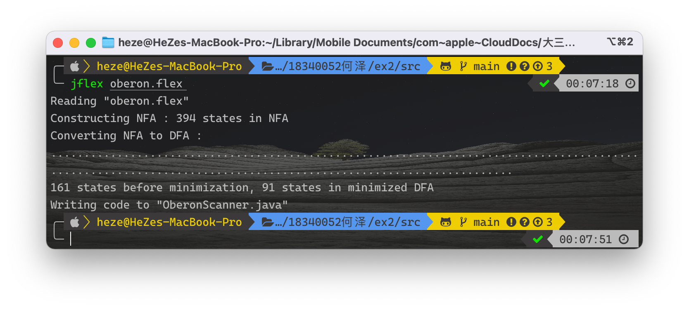
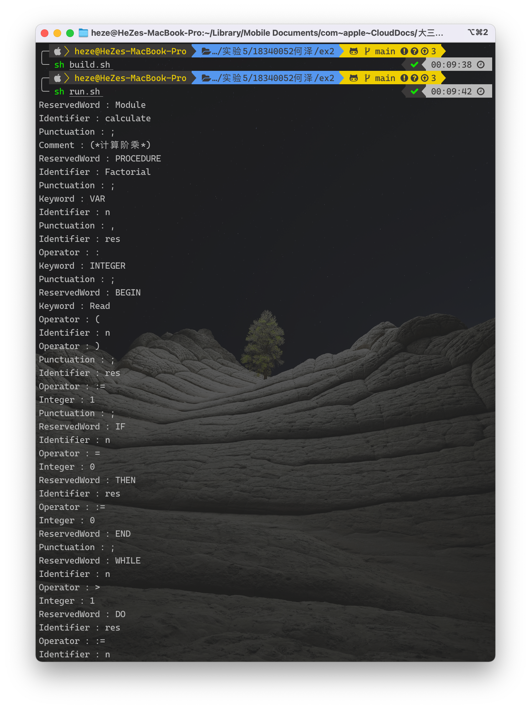
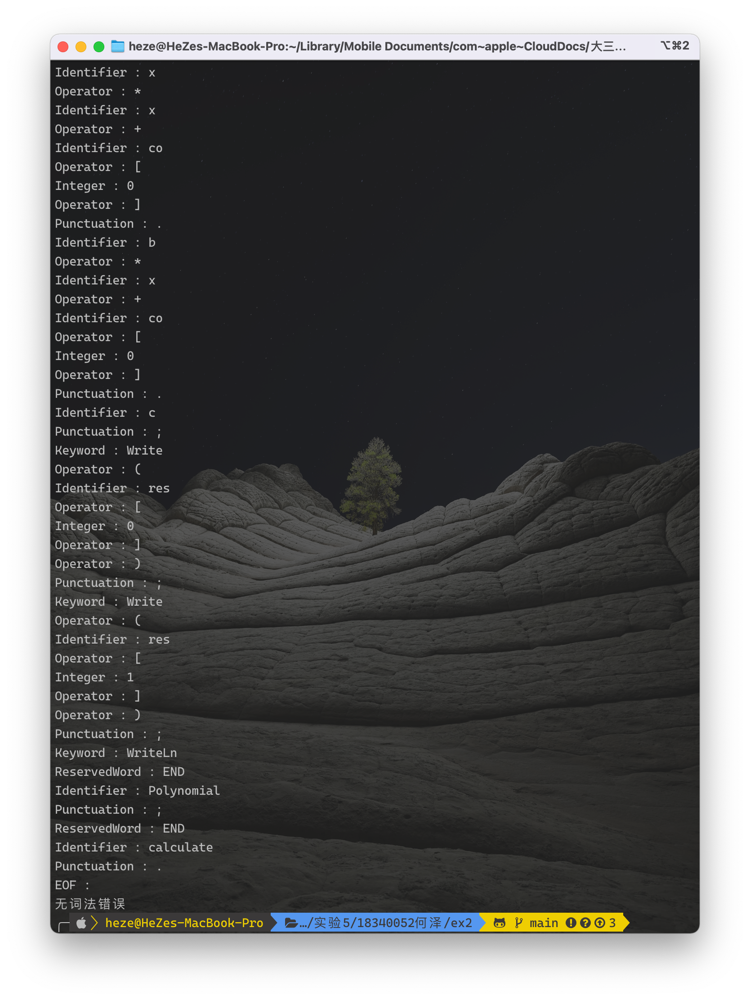
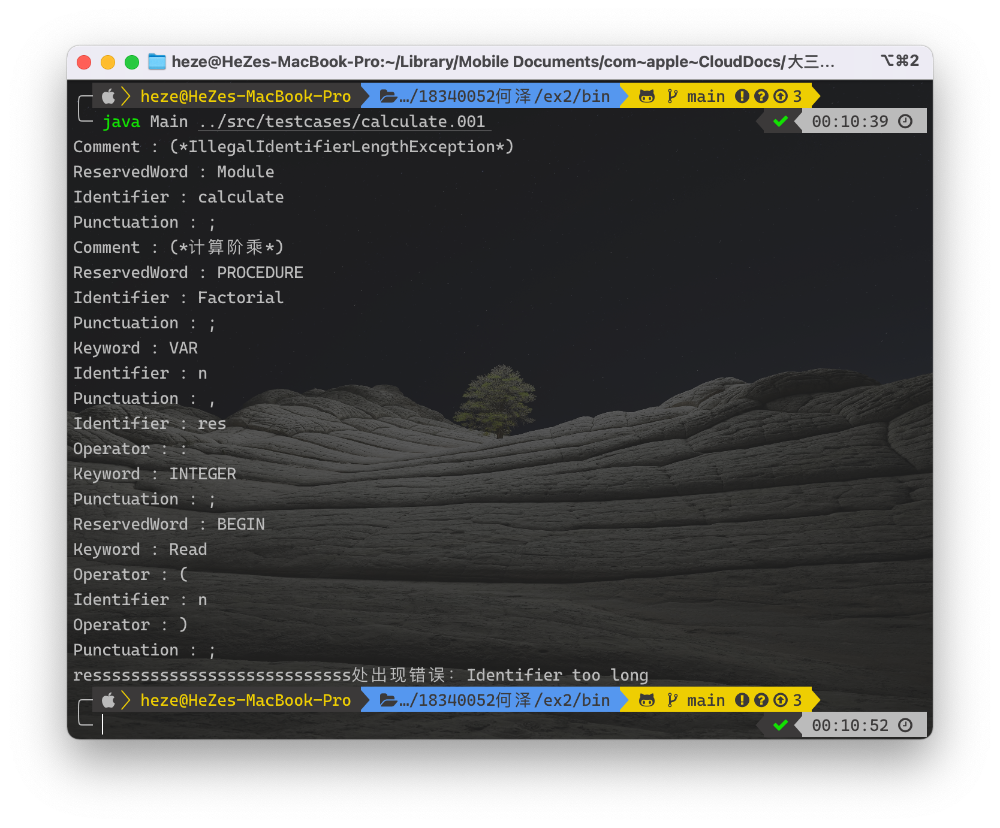
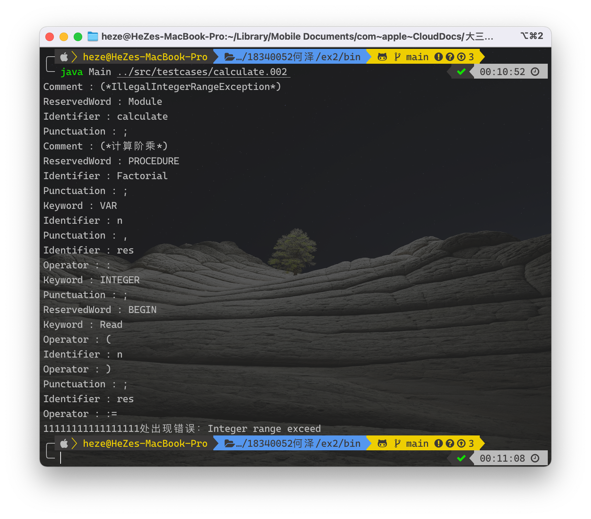
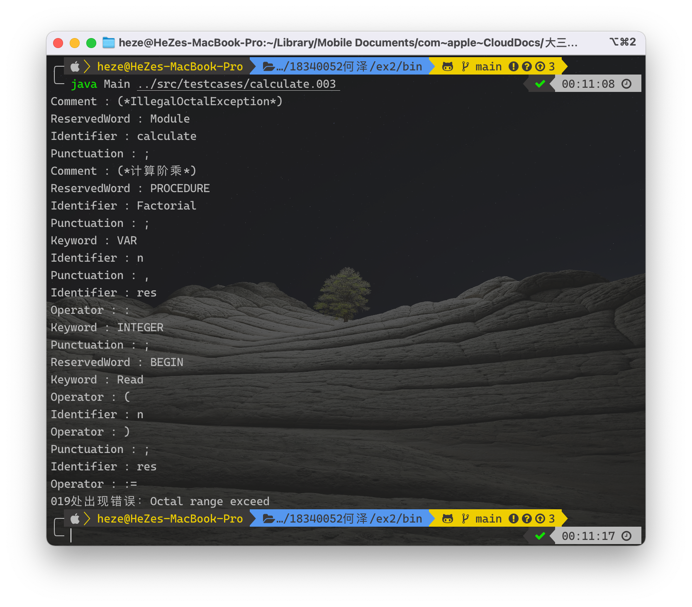
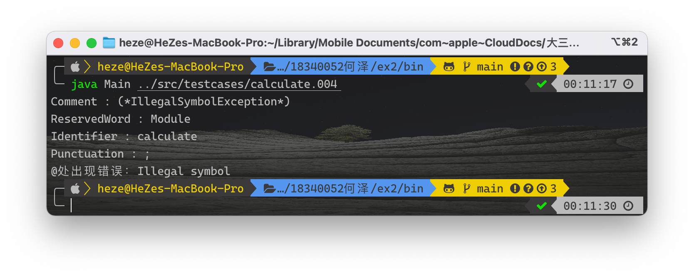

<h1 align=center>实验二、自动生成词法分析程序(JFlex)</h1>

<h1 align=center>18340052  何泽</h1>

## 实验步骤 2.1、总结 Oberon-0 语言的词汇表

### 词汇表

<table align="center" style="undefined;table-layout: fixed; ">
<colgroup>
    <col style="width: 20%">
    <col style="width: 20%">
    <col style="width: 60%">
</colgroup>
<tbody>
  <tr>
    <td colspan="2">保留字</td>
    <td>MODULE, PROCEDURE, BEGIN, END, IF, THEN, ELSIF, ELSE, WHILE, DO, OF</td>
  </tr>
  <tr>
    <td colspan="2">关键字</td>
    <td>INTEGER, BOOLEAN, VAR, TYPE, RECORD, CONST, ARRAY, Read, Write, WriteLn</td>
  </tr>
  <tr>
    <td colspan="2">常数</td>
    <td>(1-9)+(1-9)* | 0(0-7)*</td>
  </tr>
  <tr>
    <td rowspan="6">运算符</td>
    <td>算数运算符</td>
    <td>+, -, *, DIV, MOD</td>
  </tr>
  <tr>
    <td>关系运算符</td>
    <td>=, #,  &lt;, &lt;=, &gt;, &gt;=</td>
  </tr>
  <tr>
    <td>逻辑运算符</td>
    <td>&amp;, OR, ~</td>
  </tr>
  <tr>
    <td>赋值</td>
    <td>:=</td>
  </tr>
  <tr>
    <td>定义类型</td>
    <td>:</td>
  </tr>
  <tr>
    <td>括号</td>
    <td>(, ), [, ]</td>
  </tr>
  <tr>
    <td colspan="2">标识符</td>
    <td>letter{letter|digit}</td>
  </tr>
  <tr>
    <td colspan="2">标点</td>
    <td>;  ,  .</td>
  </tr>
  <tr>
    <td colspan="2">注释</td>
    <td>(* {不含*)的语句} *)</td>
  </tr>
</tbody>
</table>

### 分类的理由及保留字与关键字

对于保留字与关键字，和实验一我的想法相同，功能主要是划分程序结构层次的被我分为了保留字，而与程序功能性相关的则被我分为了关键字，其它的就是按照其功能划分。

值得一提的是，对于"`.`"，它有2种含义，第一种是用于选择ARRAY中的元素，比如`co[0].a`，此时我觉得应该归类于运算符用于选择；第二种是语法规定的对于MODULE元素的结束符END+module名称之后的结束符，比如`END calculate.`，此时就只是一个普通的标点。那么同一种符号有两种含义，到底把它归为运算符还是标点我就很纠结，想了很久最后将它归为了标点。

## 实验步骤 2.2、抽取 Oberon-0 语言的词法规则

### 词法定义

digit -> [0-9]

letter -> [a-z A-Z]

integer -> 0[0-7]* | \[1-9]( digit )*

identifier -> letter ( letter | digit )*

### 词法规则的异同

Oberon-0使用#表示不等于，or表示或，～表示非，:=为赋值，DIV为除法，MOD取余，注释等等这些都是不同的地方，而且也没有浮点数、字符串等类型。

## 实验步骤 2.3、下载词法分析程序自动生成工具 JFlex

## 实验步骤 2.4、生成 Oberon-0 语言的词法分析程序

### 运行JFlex

### 编译+运行正确的源文件

### 运行有词法错误的程序

测例1:字符过长

测例2:常量超过范围

测例3:八进制常量出现8、9

测例4:出现非法字符

## 实验步骤 2.5、讨论不同词法分析程序生成工具的差异

首先，对于源文件的结构，Jflex和Jlex分为了用户代码、选项声明、此法规则这三部分。而gnu flex则是分为definitions、rules与user code；此外，他们的词法、语法规则也都有差异；最后，Jflex和Jlex是在Java环境中运行的而gnu flex则是在c环境运行的。

