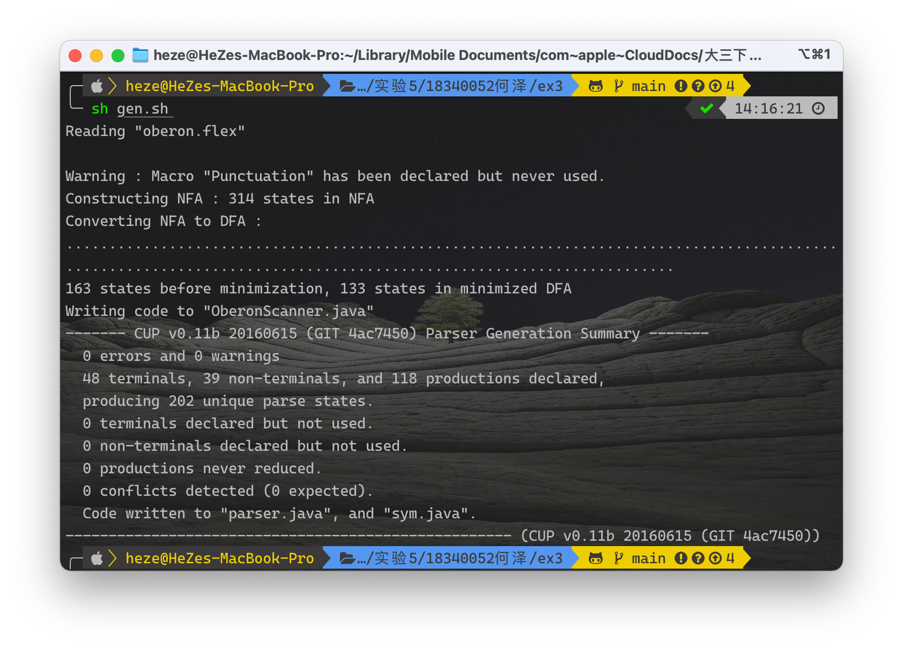
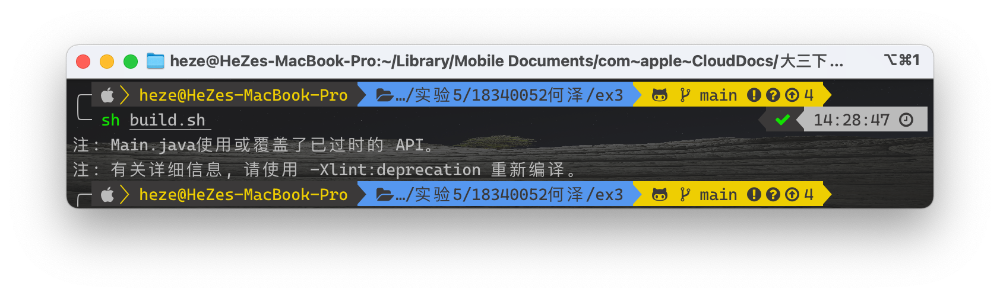
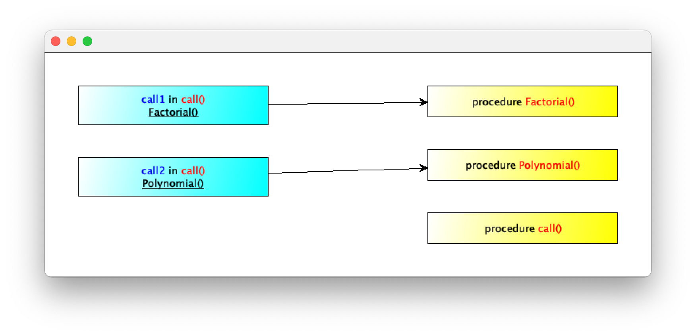
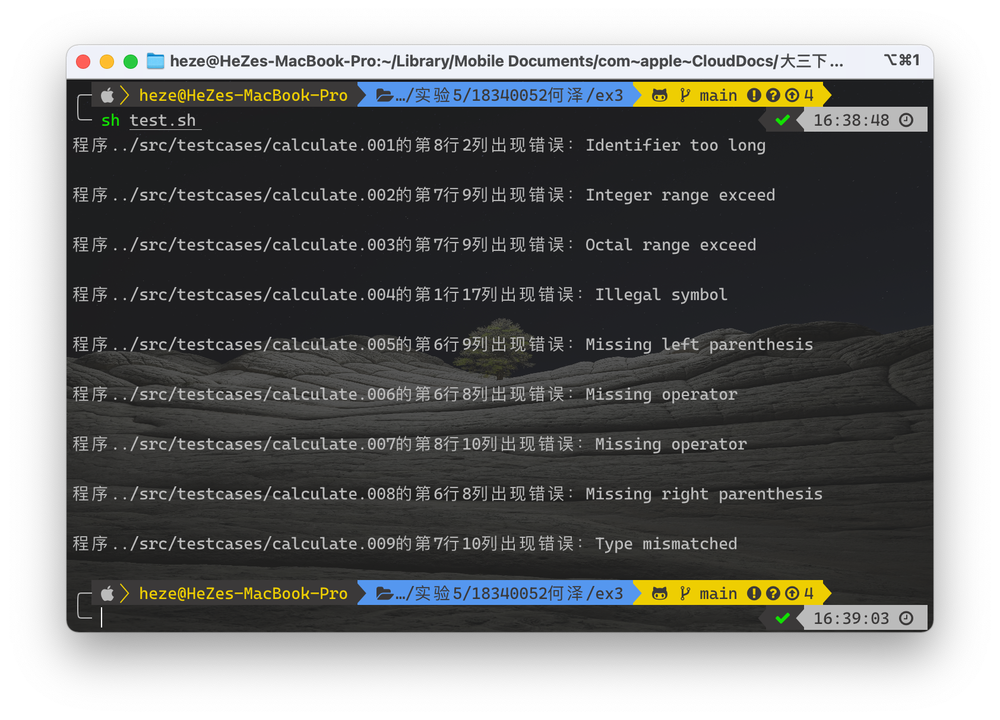

<h1 align=center>实验三、自动生成语法分析程序(JavaCUP)</h1>

<h1 align=center>18340052  何泽</h1>

## 实验步骤 3.3、生成 Oberon-0 语法分析和语法制导翻译程序

运行正确源程序可以得到调用图：

运行有错误的程序：

## 实验步骤 3.4、讨论不同生成工具的差异

对于JavaCUP 和 GNU Bison，在语法规则定义方面，定义优先级时JavaCUP的语法是`precedence right/left non-terminal-name`，而GNU Bison是`%left/right  non-terminal-name`，此外，JavaCUP的reduce的结果通过result返回而GNU Bison通过$返回。

而对于 JavaCC 与 JavaCUP，语法也有很大不同，JavaCC的parser需要PARSER_BEGIN和PARSER_END，语法分析器的token需要用<>包围等等，差别还是较大的。